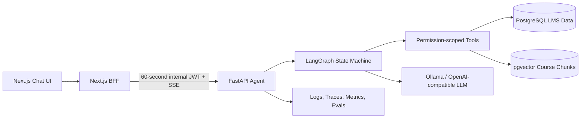

# CoursePilot

Production-oriented AI learning agent built on a full-stack course management platform.

[](https://github.com/HousenZhu/react/actions/workflows/web.yml)
[](https://github.com/HousenZhu/react/actions/workflows/ai-agent.yml)

CoursePilot turns real LMS data into permission-scoped Agent tools. Instead of injecting one
large user-context string into a chatbot prompt, it uses a bounded LangGraph workflow to query
courses, assessments, progress, deadlines, study plans, and indexed course materials. Responses
stream to the Next.js UI with tool status, citations, and persistent conversation history.

## Why This Project

This repository demonstrates an end-to-end AI backend rather than a chat-completion wrapper:

- A standalone asynchronous Python service with typed API and tool contracts.
- Server-controlled identity propagation; the model cannot choose another user's ID.
- Citation-backed RAG over course PDFs with enrollment filtering before vector ranking.
- Persistent LangGraph checkpoints, product conversation history, and structured study plans.
- SSE token streaming with visible tool lifecycle events in the web client.
- Timeouts, bounded model/tool loops, structured logs, traces, metrics, and offline evaluations.

## Architecture



The graph is intentionally bounded:

```text
validate -> agent -> tools -> agent -> verify -> persist
                     ^__________|
```

This single-agent design keeps latency, cost, failure recovery, and evaluation easier to reason
about than a multi-agent system.

## Core Capabilities

- Diagnose learning progress using enrollment, quiz, assignment, and deadline data.
- Generate and persist structured seven-day study plans.
- Retrieve authorized PDF passages with source title and page citations.
- Restore multi-turn conversations after a browser refresh.
- Stream tokens and statuses such as `get_assessment_performance started`.
- Reject cross-user access through JWT identity, fixed SQL, and repository-level filtering.
- Expose `/health/live`, `/health/ready`, `/metrics`, and OpenAPI documentation.

## Technology

| Area | Stack |
| --- | --- |
| Web | Next.js 14, React, TypeScript, Tailwind CSS |
| Authentication | Better Auth, short-lived internal HS256 JWT |
| Agent | Python 3.12, FastAPI, Pydantic v2, LangGraph |
| Data | PostgreSQL, Prisma, SQLAlchemy Async, Alembic, pgvector |
| RAG | pypdf, all-MiniLM-L6-v2, exact cosine retrieval |
| LLM | Ollama with Qwen3 4B; configurable OpenAI-compatible endpoint |
| Reliability | SSE, HTTP timeouts, bounded retries and tool iterations |
| Observability | structlog, OpenTelemetry, Prometheus metrics |
| Quality | pytest, HTTPX, Ruff, mypy, GitHub Actions |
| Runtime | Docker Compose |

## Security Boundaries

- The browser calls only the Next.js `/api/chatbot` BFF.
- Next.js validates the Better Auth session and signs a 60-second internal token.
- FastAPI injects the authenticated user into runtime Tool context.
- Tool schemas never expose a model-controlled `user_id` argument.
- LMS access uses fixed, parameterized queries; generated SQL is not executed.
- Retrieval checks enrollment before searching vectors to prevent cross-course leakage.
- Logs retain trace IDs and operational metadata, not session cookies or full private prompts.

See [architecture decisions](ai-agent/docs/architecture.md) for tradeoffs and scale paths.

## Run Locally

### Prerequisites

- Docker Desktop
- Ollama
- At least 8 GB RAM; 16 GB is recommended for the full stack

### 1. Prepare the model

```bash
ollama pull qwen3:4b
```

Ollama must remain available as a background service, but `ollama run` does not need to stay
open. Docker reaches the host through `host.docker.internal` on Windows and macOS.

### 2. Configure the application

Copy `.env.example` to `.env`, then replace the placeholder secrets. The default LLM settings
already target local Ollama.

Required values:

```env
BETTER_AUTH_SECRET=replace-with-a-random-secret
AGENT_INTERNAL_SECRET=replace-with-a-different-32-character-secret
LLM_API_KEY=ollama
LLM_BASE_URL=http://host.docker.internal:11434/v1
LLM_MODEL=qwen3:4b
```

AWS S3 variables are optional until file upload or remote PDF indexing is used. Never commit
the local `.env` file.

### 3. Start the stack

```bash
docker compose up --build -d
docker compose ps
```

Open:

- Web application: http://localhost:3000
- Agent API documentation: http://localhost:8000/docs
- Agent readiness: http://localhost:8000/health/ready
- Prisma Studio: http://localhost:5555 after starting it with the command below

```bash
docker compose exec -d web npm run db:studio -- --hostname 0.0.0.0 --port 5555
```

Stop services while preserving database data:

```bash
docker compose down
```

Do not add `-v` unless deleting all local PostgreSQL data is intentional.

## API Contract

The browser-facing BFF proxies a typed SSE protocol from the Agent:

```text
POST /v1/agent/runs/stream
events: token | tool_status | final | error
```

The final event contains `conversation_id`, `answer_markdown`, `citations`, an optional
`study_plan`, suggested actions, and a trace ID. Protected Agent endpoints require the internal
JWT and are not designed for direct browser access.

## Quality and Evaluation

Agent tests cover schema validation, JWT security, tenant isolation, ingestion, and planning.
The offline dataset contains 30 cases for tool routing, grounding, authorization, and adversarial
inputs.

```bash
cd ai-agent
pip install -e ".[dev]"
ruff check app tests evals
mypy app --ignore-missing-imports
pytest
```

Evaluation targets are documented, but no target metric is presented as an achieved result.
Measured routing accuracy, citation coverage, latency, and token usage should only be published
after generating an evaluation report against representative data.

## Repository Layout

```text
ai-agent/                 FastAPI, LangGraph, tools, RAG, tests, and evaluations
src/app/                  Next.js pages, Route Handlers, and Server Actions
src/components/chatbot/   SSE chat interface and grounded response rendering
prisma/                   LMS data model and seed data
docker/postgres/          PostgreSQL and pgvector initialization
.github/workflows/        Web and Agent quality pipelines
```

## Deliberate Limits

- V1 serves student learning workflows; it does not modify grades.
- PDF ingestion supports text PDFs, not OCR for scanned documents.
- Exact vector search is preferred until corpus measurements justify HNSW.
- Local Ollama is optimized for reproducible demos, not high-throughput production serving.
- The in-memory discussion SSE broadcaster would require Redis for horizontal Web scaling.

## Additional Material

- [Agent service guide](ai-agent/README.md)
- [Architecture decisions](ai-agent/docs/architecture.md)
- [Five-minute demo and interview discussion map](ai-agent/docs/demo-script.md)
- [Resume-ready project descriptions](ai-agent/docs/resume.md)
- [Original LMS walkthrough](https://www.youtube.com/watch?v=XEOUFniIkoA)

## License

MIT
